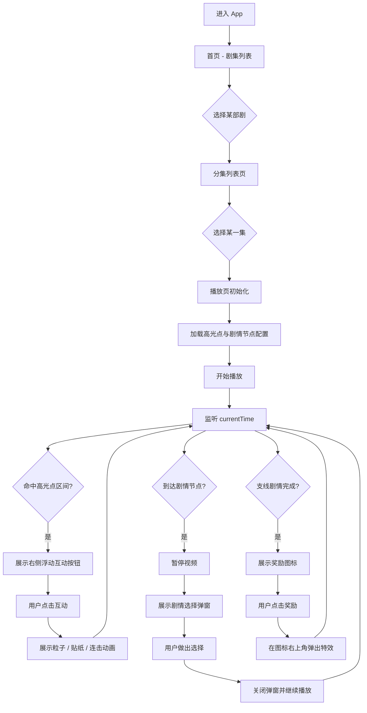

# 项目技术文档

## 1. 模块分析与整体流程

### 1.1 模块拆解

本项目可拆解为以下 6 个核心模块：

| 模块 | 职责 | 核心文件 |
|------|------|----------|
| 内容资源模块 | 管理视频、封面、互动贴纸等静态资源 | assets/ |
| 剧集数据管理模块 | 维护“剧 -> 分集”的结构化关系 | src/data/dramas.js |
| 播放器与播放控制模块 | 视频播放、暂停、进度条拖动 | src/screens/PlayerScreen.js |
| 高光点互动模块 | 在指定时间触发互动组件、粒子、贴纸、连击 | src/data/highlights.js, PlayerScreen.js |
| 剧情节点交互模块 | 在关键节点暂停并弹出选择弹窗 | src/data/interactions.js, PlayerScreen.js |
| 内容理解与 AI 标注模块 | （规划中）视频/台词理解，自动标注高光点 | - |

### 1.2 整体流程图



---

## 2. 核心模块技术选型与理由

### 2.1 客户端 / 前端

| 技术 | 选型 | 选型理由 |
|------|------|----------|
| 跨平台框架 | Expo + React Native | 1. 团队开发效率高，一套代码跑 iOS/Android<br>2. Expo 生态完善，开箱即用的组件多<br>3. 热更新方便，适合快速迭代与 Demo 验证 |
| 导航方案 | @react-navigation/native + native-stack | 1. React Native 生态最主流的导航库<br>2. 堆栈导航符合“首页 -> 分集 -> 播放页”的层级<br>3. 性能与原生体验较好 |
| 视频播放 | expo-video | 1. 与 Expo SDK 兼容度最高<br>2. 提供 useVideoPlayer Hook，易于监听播放时间与状态<br>3. 支持全屏、暂停、时间跳转等基础能力 |
| 交互动画 | React Native 内置 Animated | 1. 能满足当前粒子、缩放、旋转、淡入淡出等轻量动效<br>2. 不额外引入第三方库，减少包体积<br>3. useNativeDriver 保证动画流畅度 |
| 数据管理 | 本地 JS 配置文件 | 1. 当前阶段数据量小，不需要后端<br>2. 配置集中化，易于调试与演示<br>3. 后续可平滑迁移为 API 下发 |

### 2.2 后端（规划中）

| 模块 | 规划选型 | 说明 |
|------|----------|------|
| 服务端框架 | 待确定 | 用于高光点、剧情节点数据下发与埋点上报 |
| 数据存储 | 结构化数据库 | 存储用户互动行为与标注结果 |

### 2.3 AI 模型（规划中）

| 能力 | 规划选型 | 说明 |
|------|----------|------|
| 语音转文本 | ASR 服务 | 将视频音频转为带时间戳的台词 |
| 剧情理解 | 大模型（如 GPT、通义千问等） | 基于台词进行片段级剧情理解、高光分类、摘要生成 |

---

## 3. 大模型 / AI 能力使用说明（当前与规划）

### 3.1 当前阶段（离线模拟）

当前 Demo **尚未接入真实大模型推理**，而是使用“人工标注配置”模拟 AI 输出，用于验证链路可行性。

**高光点数据结构示例**：
```javascript
{
  id: 'h1',
  type: '爽',
  startSec: 8,
  endSec: 15,
  score: 0.8,
  stickerText: '🔥',
  title: '燃爆！',
  subtitle: '爽翻了'
}
```

### 3.2 规划中的 Prompt 设计与调用方式

#### 3.2.1 调用方式
- **兼容模式**：OpenAI API 兼容接口
- **输入**：一段带时间戳的台词 + 视频基本信息
- **输出**：结构化 JSON，包含高光点列表

#### 3.2.2 Prompt 设计思路
```
你是一个专业的短剧内容理解助手。请阅读以下短剧台词片段，识别出其中的高光点。

【高光类型定义】
- 爽：主角复仇、反击、打脸、获得巨大收益
- 反转：剧情出现意外转折、真相揭露
- 名场面：经典台词、名场面、观众印象深刻的片段
- 撒糖：情侣互动、甜蜜时刻

【台词片段】
（00:08）主角：今天我要拿回属于我的一切！
（00:10）反派：就凭你？
（00:12）主角：就凭我！（展示系统/能力）
...

请以 JSON 格式输出高光点列表，包含：type（类型）、startSec（开始秒数）、endSec（结束秒数）、title（标题）、subtitle（副标题）。
```

---

## 4. 工程难点与解决方案

### 难点 1：高光点与视频进度的精准同步

**问题**：
- 视频播放时间 `currentTime` 更新频率不固定
- 进度条拖动时也需要即时匹配高光点
- 拖动结束后需要平滑衔接

**解决方案**：
- 使用 `useMemo` 监听 `currentTime`、`isScrubbing`、`scrubProgress` 等多个依赖
- 拖动中优先使用 `scrubProgress * duration` 计算时间，拖动结束后再用播放器时间
- 将匹配逻辑与渲染逻辑分离，确保响应式更新

**核心代码**（PlayerScreen.js）：
```javascript
const activeHighlight = useMemo(() => {
  const t = isScrubbing ? scrubProgress * (duration || 0) : currentTime;
  return highlights.find(item => t >= item.startSec && t <= item.endSec) ?? null;
}, [currentTime, duration, highlights, isScrubbing, scrubProgress]);
```

---

### 难点 2：多元化交互动画的性能保证

**问题**：
- 高光按钮需要“呼吸”“旋转”“弹跳”等循环动画
- 粒子特效需要同时生成多个并向上漂浮
- 主线程不能卡顿

**解决方案**：
- 使用 React Native `Animated` + `useNativeDriver: true`，将动画放到原生线程
- 粒子数组长度控制在合理范围（8-10 个）
- 使用 `useRef` 保存动画值，避免不必要的重渲染

---

### 难点 3：支线剧情与主剧情的无缝衔接

**问题**：
- 进入支线时主剧情需要暂停
- 支线播放完需要展示奖励，而不是立即切回
- 用户可能在支线中间退出

**解决方案**：
- 使用两个独立的 `VideoPlayer`：一个主剧，一个支线
- `activeBranch` 状态控制显示哪个播放器
- 支线播放完成时不自动关闭，而是设置 `branchRewardVisible`，等待用户交互
- 提供叉号按钮，允许用户随时关闭支线或奖励

---

## 5. 工作项拆分与排期

### 5.1 单人版本（5 个工作日）

| Day | 工作项 | 交付物 |
|-----|--------|--------|
| 1 | 项目结构搭建、导航打通、剧集数据结构 | 首页、分集页可跳转，基础框架完成 |
| 2 | 接入 expo-video、播放/暂停、进度条拖动 | 完整的播放器基础能力 |
| 3 | 高光点数据结构、右侧浮动按钮、粒子与贴纸 | 高光点互动完整功能 |
| 4 | 剧情节点弹窗、支线剧情、奖励与特效 | 剧情参与型互动完整功能 |
| 5 | 文档整理、Demo 自测、录屏 | 完整的技术文档与可演示的 Demo |

### 5.2 组队版本（5-7 个工作日，3 人小组）

| 角色 | 分工 |
|------|------|
| **客户端开发** | 首页、分集页、播放页 UI 与交互<br>播放器控制、高光点 UI、剧情弹窗、动效实现 |
| **内容理解 / 算法** | 视频转文本、字幕整理<br>高光点标签定义、大模型 Prompt 设计<br>样例标注数据输出 |
| **产品与整合** | 交互方案设计、高光点文案与展示策略<br>技术文档撰写、Demo 录屏与答辩材料整理 |

**排期建议**：
- 第 1 天：统一需求、确定技术方案、定义数据结构
- 第 2-3 天：客户端播放链路 + 算法侧标注样例
- 第 4-5 天：高光点数据与互动展示联调
- 第 6 天：剧情节点弹窗与支线剧情
- 第 7 天：UI 优化、文档完善、演示录制
