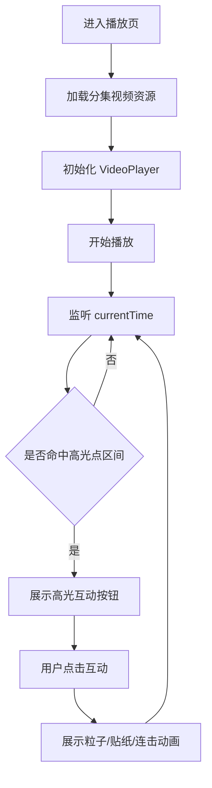
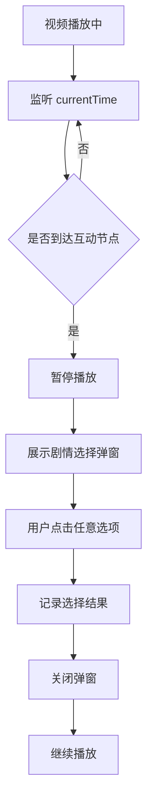
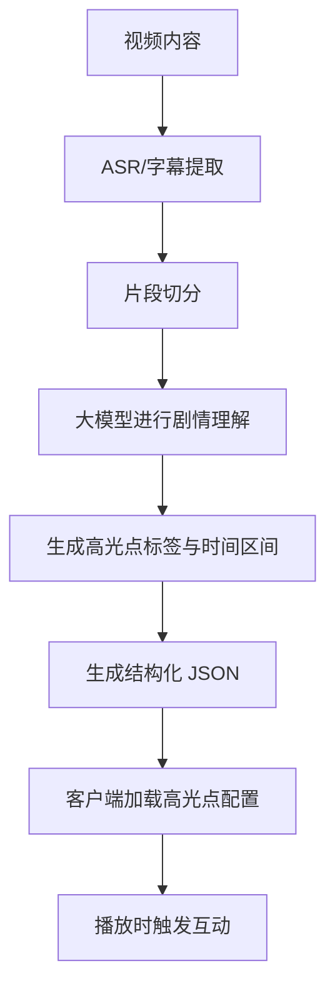

# 短剧互动播放 Demo 技术文档

## 1. 项目概述

本项目是一个基于 Expo + React Native 的短剧互动播放 Demo，围绕“短剧内容理解 + 高光点互动 + 剧情节点弹窗”展开设计与实现。当前 Demo 已实现以下核心能力：

- 两部短剧的本地化管理与播放
- 剧集列表、分集列表、播放页三层结构
- 高光点识别结果的本地下发与播放时触发
- 高光点互动组件展示，包括“爽 / 反转 / 名场面 / 撒糖”
- 剧情节点弹窗交互，例如在指定时间点暂停视频并引导用户做选择
- 播放页基础交互，包括单击画面播放/暂停、拖动进度条等

本 Demo 的目标不是完成全量生产化系统，而是验证“内容理解结果如何驱动互动体验”的整体链路，为后续接入更强的内容分析算法、多模态模型、后端服务与在线分发机制打基础。

## 2. 模块分析与拆解

### 2.1 模块总览

项目可拆解为 6 个核心模块：

1. 内容资源模块
2. 剧集数据管理模块
3. 播放器与播放控制模块
4. 高光点互动模块
5. 剧情节点交互模块
6. 内容理解与 AI 标注模块

### 2.2 各模块职责说明

#### 2.2.1 内容资源模块

职责：

- 管理短剧视频、封面、互动贴纸图片等静态资源
- 对资源进行命名规范化，避免中文路径与动态加载兼容问题

当前实现：

- 视频存放于 `assets/videos/`
- 封面存放于 `assets/covers/`
- 高光点互动贴纸存放于 `assets/icons/`

设计原因：

- 当前 Demo 为本地打包方案，所有视频和互动素材随 App 一起分发，便于离线调试和快速验证

#### 2.2.2 剧集数据管理模块

职责：

- 管理“剧 -> 分集”的结构化数据
- 为首页、分集页、播放页提供统一的数据源

当前实现：

- 使用 `src/data/dramas.js` 维护剧集与分集关系
- 每部剧包含 `title`、`cover`、`episodes`
- 每集包含 `id`、`title`、`video`

设计原因：

- 通过结构化配置代替散落的页面逻辑，使剧集增加、删除、排序更容易维护

#### 2.2.3 播放器与播放控制模块

职责：

- 视频播放
- 播放/暂停控制
- 单击视频区域切换播放状态
- 进度条展示与拖动跳转

当前实现：

- 使用 `expo-video` 提供 `VideoView` 与 `useVideoPlayer`
- 在 `PlayerScreen.js` 中实现播放控制逻辑
- 使用 `timeUpdate` 事件获取当前播放时间

设计原因：

- `expo-video` 与当前 Expo 技术栈兼容度高，接入成本低，适合快速搭建移动端视频播放 Demo

#### 2.2.4 高光点互动模块

职责：

- 在视频播放到指定时间点时触发互动组件
- 展示“爽 / 反转 / 名场面 / 撒糖”等高光类型
- 支持点击互动后触发粒子、贴纸和连击反馈

当前实现：

- 高光点配置存放于 `src/data/highlights.js`
- 按 `episodeId` 管理高光点列表
- 播放页根据 `currentTime` 动态匹配当前高光点
- 不同高光类型映射不同配色、图标、粒子与动效

设计原因：

- 先采用“离线标注 + 本地下发”的 MVP 方案，快速验证高光点驱动交互的可行性

#### 2.2.5 剧情节点交互模块

职责：

- 在指定剧情节点暂停视频
- 弹出选择弹窗，引导用户参与互动
- 用户选择后关闭弹窗并继续播放

当前实现：

- 交互配置存放于 `src/data/interactions.js`
- 当前在 `huangnian-ep01` 的 64 秒位置触发选择弹窗
- 播放页在命中事件后自动暂停，并展示交互弹窗

设计原因：

- 该模块用于验证“内容理解结果不仅能触发情绪互动，也能触发剧情参与型互动”

#### 2.2.6 内容理解与 AI 标注模块

职责：

- 基于视频/字幕/台词等信息识别剧情高光点
- 将识别结果映射为时间段、类型、文案、互动方式
- 为客户端提供统一的互动基础数据

当前阶段实现方式：

- 当前 Demo 使用手工配置模拟 AI 识别结果
- 高光点与剧情节点先写入本地 JSON/JS 配置中

后续规划：

- 接入 ASR（自动语音识别）获取带时间戳台词
- 接入大模型进行片段级剧情理解与标签判定
- 生成结构化标注数据后下发至客户端

## 3. 核心模块技术选型

### 3.1 前端框架

- 技术：Expo + React Native
- 选择原因：
  - 跨平台开发效率高
  - 适合快速构建互动 Demo
  - 与现有项目结构保持一致

### 3.2 导航方案

- 技术：`@react-navigation/native` + `@react-navigation/native-stack`
- 选择原因：
  - 页面结构简单清晰
  - 适合首页 -> 分集 -> 播放页的层级导航

### 3.3 视频播放

- 技术：`expo-video`
- 选择原因：
  - 与 Expo 生态兼容
  - 易于监听播放状态与时间进度
  - 支持全屏、暂停、时间跳转等常见能力

### 3.4 数据管理

- 技术：本地 JS 配置文件
- 选择原因：
  - 当前阶段数据量小
  - 适合快速迭代与演示
  - 后续可平滑迁移为接口下发

### 3.5 互动动画实现

- 技术：React Native `Animated`
- 选择原因：
  - 能满足当前轻量动效需求
  - 不额外增加第三方依赖
  - 适合实现缩放、旋转、淡入淡出、漂浮等基础动画

### 3.6 内容理解能力

- 当前阶段：离线人工标注 / 模拟 AI 输出
- 后续方案：
  - ASR：将视频转为台词文本
  - 大模型：进行剧情理解、高光点标签分类、摘要生成
  - 可选多模态增强：结合画面变化、镜头切换、音频能量等信号

## 4. 主要流程图

### 4.1 客户端播放与高光点触发流程



### 4.2 剧情节点弹窗触发流程



### 4.3 内容理解数据下发流程



## 5. 数据结构设计

### 5.1 剧集数据结构

```js
{
  id: 'huangnian',
  title: '荒年全村啃树皮，我有系统满仓肉',
  cover: require('../../assets/covers/huangnian.png'),
  episodes: [
    {
      id: 'huangnian-ep01',
      title: '第01集',
      video: require('../../assets/videos/huangnian/ep01.mp4'),
    }
  ]
}
```

### 5.2 高光点数据结构

```js
{
  id: 'h2',
  type: '反转',
  startSec: 40,
  endSec: 52,
  score: 0.85,
  stickerText: '🔄',
  title: '神反转！',
  subtitle: '竟然！'
}
```

### 5.3 剧情节点交互数据结构

```js
{
  id: 'choice-ep01-064',
  type: 'choice',
  atSec: 64,
  title: '主角倒了，你想怎么做？',
  options: [
    { id: 'revive', label: '扣1复活' },
    { id: 'no_die', label: '我不想死' },
  ],
}
```

## 6. 工作项拆分与排期

### 6.1 单人版本排期（适用于当前 Demo）

总周期建议：5 个工作日

#### Day 1：项目结构整理

- 完成剧集数据结构重构
- 完成视频资源命名规范整理
- 首页、分集页、播放页导航打通

#### Day 2：播放器能力完善

- 接入视频播放组件
- 实现播放/暂停
- 实现单击屏幕切换播放
- 实现进度条展示与拖动跳转

#### Day 3：高光互动模块

- 设计高光点数据结构
- 接入“爽 / 反转 / 名场面 / 撒糖”交互逻辑
- 实现高光按钮、连击、粒子、贴纸效果

#### Day 4：剧情节点互动

- 新增剧情选择弹窗数据结构
- 实现到点暂停、弹窗展示、选择后继续播放
- 调整 UI 与交互时序

#### Day 5：内容理解链路梳理与文档沉淀

- 输出“AI 内容理解 -> 标注 -> 下发 -> 播放触发”的完整链路说明
- 补充技术文档、流程图、模块设计说明
- 完成 Demo 演示自测

### 6.2 组队版本分工示例

若为 3 人小组，建议分工如下：

#### 角色 A：客户端开发

- 负责首页、分集页、播放页
- 负责播放器交互、高光点 UI、剧情弹窗交互

#### 角色 B：内容理解 / 算法方向

- 负责视频转文本、字幕整理
- 负责高光点标签定义
- 负责大模型提示词设计与标注结果输出

#### 角色 C：产品与技术方案整合

- 负责交互方案设计
- 负责高光点文案、展示策略、触发机制设计
- 负责技术文档撰写、Demo 录屏与答辩材料整理

### 6.3 组队版本排期建议

总周期建议：5~7 个工作日

- 第 1 天：统一需求、定义高光点标签体系、确定技术方案
- 第 2~3 天：客户端播放链路实现、算法侧输出标注样例
- 第 4~5 天：联调高光点数据与互动展示
- 第 6 天：加入剧情节点弹窗与特殊互动
- 第 7 天：优化 UI、完善文档、录制演示

## 7. AI 参与说明

本项目允许并鼓励在各环节使用 AI 辅助，当前 AI 参与主要体现在以下几个方面：

### 7.1 技术方案辅助

- 使用 AI 辅助拆解模块边界
- 使用 AI 辅助设计前端交互结构和数据结构
- 使用 AI 辅助编写与调整技术文档内容

### 7.2 代码实现辅助

- 使用 AI 辅助生成页面结构、动画逻辑与配置文件模板
- 使用 AI 辅助调试播放器交互逻辑与高光点触发逻辑
- 使用 AI 辅助快速生成静态交互素材接入方案

### 7.3 内容理解能力设计辅助

- 使用 AI 辅助定义高光点标签体系
- 使用 AI 辅助设计“台词片段 -> 剧情高光类型”的提示词模板
- 使用 AI 辅助生成样例高光点文案和剧情节点文案

### 7.4 视觉素材辅助

- 使用 AI 辅助生成互动贴纸、弹幕效果图与示意素材
- 对生成素材进行筛选、透明化处理与移动端适配

### 7.5 AI 参与边界说明

- AI 当前主要作为“辅助设计 + 辅助开发 + 辅助文档整理”工具
- Demo 中的高光点数据当前仍有人工配置成分
- 后续若接入真实大模型推理链路，AI 将参与内容理解主流程

## 8. 当前成果与后续规划

### 8.1 当前成果

- 已完成短剧双剧集管理
- 已完成分集播放
- 已完成高光点互动
- 已完成剧情节点弹窗交互
- 已完成基础内容理解链路的数据结构设计

### 8.2 后续规划

- 将高光点配置从本地 JS 升级为接口下发
- 接入字幕/ASR 结果，减少手工标注
- 接入大模型自动输出高光点标签
- 增加更强的剧情分叉和 AIGC 插片能力
- 增加互动行为埋点，分析用户点击率与互动效果

## 9. 总结

本项目围绕“短剧内容理解驱动互动播放”构建了一套轻量但完整的 Demo 链路。通过本地播放、结构化高光点数据、剧情节点弹窗和基础交互动画，我们已经验证了以下核心能力：

- 内容理解结果可以转化为客户端可消费的数据
- 高光点数据可以驱动情绪型互动展示
- 特定剧情节点可以触发参与式交互
- Expo + React Native 技术栈能够支撑移动端快速验证

该 Demo 已具备继续扩展到“真实 AI 标注 + 接口下发 + 多模态理解 + 更复杂互动机制”的基础。

